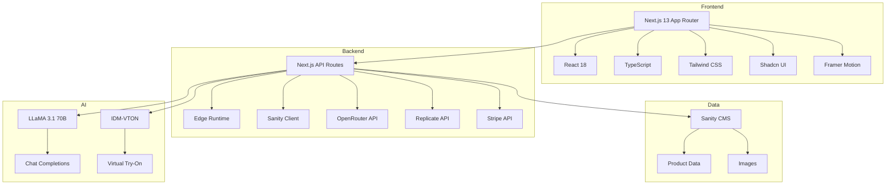

# 🛍️ DressCode - E-Commerce Platform with AI Integration

<div align="center">


**A modern e-commerce platform enhanced with AI-powered shopping assistance and virtual try-on**

[Live Demo](https://dress-code.vercel.app/) • [Features](#-features) • [Tech Stack](#-tech-stack) • [Getting Started](#-getting-started)

</div>

---

## 📖 About The Project

**DressCode** started as one of my first Next.js projects—a learning journey into modern web development and e-commerce architecture. Today, I've revisited this project to add a **modern AI twist**, transforming it from a traditional online store into an **intelligent shopping experience** with virtual try-on capabilities.

### 🎯 Why This Project?

This project demonstrates:
- **Evolution of skills**: From foundational Next.js development to advanced AI integration
- **Full-stack capabilities**: Backend, frontend, CMS, payments, and AI orchestration
- **Modern architecture**: Headless CMS, Edge Runtime, streaming responses
- **Real-world application**: Production-ready e-commerce with cutting-edge features

---

## ✨ Features

### 🛒 Core E-Commerce
- **Product Catalog** with dynamic filtering (category, size, color, price)
- **Search functionality** with wildcard matching
- **Shopping Cart** powered by `use-shopping-cart`
- **Stripe Integration** for secure payments
- **Responsive Design** with Tailwind CSS
- **Dark Mode** support

### 🤖 AI-Powered Features
- **Personal Stylist Chatbot**: AI assistant that recommends products based on user queries
  - Powered by LLaMA 3.1 70B via OpenRouter
  - Context-aware (knows the entire product catalog)
  - Conversational interface with streaming responses
  - Rate limiting (20 messages/day per user)
  
- **Virtual Try-On**: AI-powered clothing visualization
  - Upload your photo and see how clothes look on you
  - Powered by IDM-VTON model on Replicate
  - Works with clothing items (t-shirts, pants, dresses, jackets, etc.)
  - Intuitive modal interface with drag-and-drop upload

### 🎨 Modern UI/UX
- **Marketing Hero Section**: Scroll-based image showcase with Framer Motion animations
- **Interactive Feature Cards**: Gradient hover effects highlighting AI capabilities
- **Product Hover Effects**: "Try it with AI!" overlay on product cards
- **Smooth Animations**: Powered by Framer Motion

---

## 🏗️ Tech Stack



### Technologies Used

| Category | Technologies |
|----------|-------------|
| **Framework** | Next.js 13 (App Router), React 18 |
| **Language** | TypeScript |
| **Styling** | Tailwind CSS, Shadcn UI, Radix UI |
| **Animations** | Framer Motion |
| **CMS** | Sanity (Headless CMS) |
| **AI - Chat** | LLaMA 3.1 70B via OpenRouter, Vercel AI SDK |
| **AI - Try-On** | IDM-VTON via Replicate |
| **Payments** | Stripe |
| **State Management** | use-shopping-cart |
| **Testing** | Vitest, React Testing Library |
| **Deployment** | Vercel |

---

## 🚀 Getting Started

### Prerequisites

- Node.js 16+ and npm
- A Sanity account ([sanity.io](https://www.sanity.io))
- An OpenRouter API key ([openrouter.ai](https://openrouter.ai))
- A Replicate API key ([replicate.com](https://replicate.com))
- A Stripe account ([stripe.com](https://stripe.com))

### Installation

1. **Clone the repository**
   ```bash
   git clone https://github.com/yourusername/DressCode.git
   cd DressCode
   ```

2. **Install dependencies**
   ```bash
   npm install
   ```

3. **Set up environment variables**
   
   Create a `.env.local` file in the root directory:
   ```env
   # Sanity
   NEXT_PUBLIC_SANITY_PROJECT_ID=your_project_id
   NEXT_PUBLIC_SANITY_DATASET=production
   NEXT_PUBLIC_SANITY_API_VERSION=2023-07-28
   
   # OpenRouter (for AI Chat)
   OPENROUTER_API_KEY=sk-...
   
   # Replicate (for Virtual Try-On)
   REPLICATE_API_TOKEN=r8_...
   
   # Stripe
   NEXT_PUBLIC_STRIPE_PUBLISHABLE_KEY=pk_...
   STRIPE_SECRET_KEY=sk_...
   ```

4. **Run the development server**
   ```bash
   npm run dev
   ```

5. **Access Sanity Studio**
   
   Navigate to `http://localhost:3000/studio` to manage your products.

---

## 📁 Project Structure

```
DressCode/
├── app/                      # Next.js 13 App Router
│   ├── api/
│   │   ├── chat/            # AI Chatbot API route
│   │   ├── try-on/          # Virtual Try-On API route
│   │   └── checkout/        # Stripe checkout
│   ├── products/            # Product pages
│   ├── cart/                # Shopping cart
│   ├── studio/              # Sanity Studio
│   └── page.tsx             # Home page with marketing hero
├── components/              # React components
│   ├── ui/                  # Shadcn UI components
│   ├── chat-bubble.tsx      # AI Chat interface
│   ├── fitting-room-modal.tsx # Virtual Try-On modal
│   ├── marketing-hero.tsx   # Marketing section
│   ├── product-grid.tsx     # Product listing
│   └── ...
├── sanity/                  # Sanity CMS configuration
│   ├── schemas/             # Content schemas
│   └── lib/                 # Sanity client
├── lib/                     # Utility functions
└── styles/                  # Global styles
```

---

## 🧪 Testing

Run the test suite:

```bash
npm test
```

Tests cover:
- Product grid rendering and interactions
- Fitting room modal functionality
- Try-on API logic (category detection, image URL extraction)

---

## 🎯 Future Objectives

### Short-term Goals
- [ ] **Complete the Look**: AI-powered product recommendations using vector embeddings
- [ ] **Visual Search**: Upload an image to find similar products in the catalog
- [ ] **Enhanced Chat**: Add product images in chat responses
- [ ] **User Accounts**: Save favorite items and chat history

### Long-term Vision
- [ ] **Accessory Try-On**: Extend virtual try-on to accessories
- [ ] **Personalized Collections**: AI-curated collections based on user preferences
- [ ] **Analytics Dashboard**: Track user behavior and AI interaction metrics
- [ ] **Mobile App**: React Native version with the same AI features

---

## 🤝 Contributing

This is a portfolio project, but suggestions and feedback are always welcome! Feel free to:
- Open an issue for bugs or feature requests
- Fork the repo and submit a pull request
- Reach out with ideas for improvement

---

## 📝 License

This project is open source and available under the [MIT License](LICENSE).

---

## 👨‍💻 About Me

I'm a full-stack developer passionate about building modern web applications with cutting-edge technologies. This project showcases my ability to:
- Build production-ready e-commerce platforms
- Integrate multiple AI services into real-world applications
- Work with modern frameworks and tools
- Evolve and improve existing codebases

---

<div align="center">

**Built with ❤️ using Next.js, OpenRouter, and Replicate**

⭐ Star this repo if you find it interesting!

</div>
